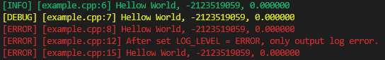

# HowLog 

This is a simple but useful  log model for c++.

**NOTE**: This logger is not thread-safe currently. Do not use it in multi-threads scenarios.


## Requirements

I use some c++17 features in the codes. Please ensure your compiler is support for c++17.


## Usage

* There is a example in example.cpp. Making and Running it then you will see colorful logs.

```bash
make
./example.o
```



* Note that there is a level mechanism in this log model.
  * L_INFO : the lowest level, print all the logs.
  * L_DEBUG : print the DEBUG logs and ERROR logs.
  * L_ERROR : only print the ERROR logs.


## NOTE

This project is based on  [An example from StackExchange](https://codereview.stackexchange.com/questions/196283/format-log-with-a-small-macro-logger). 